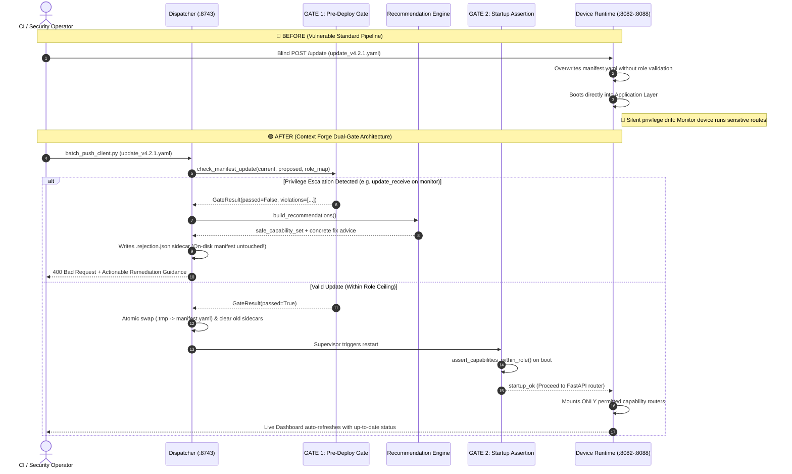

# Context Forge — Role-Bounded Fleet Security Agent

[](https://github.com/wellytg/context-forge-hackathon)
[](https://github.com/wellytg/context-forge-hackathon)
[](security-agent/tests/)
[](security-agent/pyproject.toml)
[](AGENTS.md)

A role-bounded fleet security agent with a two-layer privilege-escalation
defence, built for the **IBM TechXchange 2026 Dev Day Hackathon** using
**Bob IDE**.

---

## 📺 Hackathon Submission & Resources

- 🎥 **Video Demo Walkthrough**: [Watch the 3-Minute Demo on YouTube](https://youtu.be/TK1WRUctyhQ)
- 📜 **Reusable Build Contract**: [Read `AGENTS.md`](AGENTS.md)
- 📁 **Bob Task Session Artifacts**: [Browse `bob_sessions/`](bob_sessions/)

---

## Solution Statement

Organizations that deploy security agents across large device fleets — endpoints, workstations, servers — face a persistent risk: an update meant for one device tier can silently grant it privileges it should never hold. A routine push that broadens a low-trust device's access isn't caught by normal testing, because the update still "works" — it just works with more authority than it should. That gap is invisible until it becomes an incident.

**Context Forge** is a two-layer defense against this failure mode, built as a role-bounded fleet agent with independent, non-trusting privilege gates:
1. **Pre-Deploy Static Gate** (`deploy_gate/`, `batch_dispatcher.py`): Every device manifest declares a role (`field_tech`, `monitor`, `read_only`), and a role map defines the maximum capabilities each role may hold. Before any update reaches a device, a static gate diffs the proposed manifest against this role map and rejects any capability or role escalation.
2. **Runtime Startup Assertion** (`agent/startup.py`): Every agent re-validates its on-disk manifest at boot and aborts execution before the application layer starts if the check fails.
3. **Automated Remediation**: When an update is rejected, a recommendation engine calculates the safe capability subset via set intersection and surfaces actionable fix guidance directly on the operator CLI and per-device live dashboards.

---

## Workflow Evolution: Before vs. After Context Forge

### Sequence Comparison



### Architectural Improvements Summary

| Security & Operational Metric | ❌ BEFORE (Standard Fleets) | 🛡️ AFTER (Context Forge) |
|---|---|---|
| **Privilege Escalation Defense** | None. Manifest updates applied blindly. | Dual independent gates (pre-deploy static diff + runtime startup assertion). |
| **Source of Truth** | Implicit / scattered across device configs. | [`roles/role_map.yaml`](security-agent/roles/role_map.yaml) is the authoritative, immutable ceiling. |
| **Batch Update Resilience** | 1 corrupt file or bad path halts the whole batch. | Per-device error isolation records `[ERR] SKIPPED` without stopping remaining fleet. |
| **Remediation Experience** | Generic error tracebacks or silent failures. | Automatic calculation of `safe_capability_set` with exact fix commands. |
| **Fleet Observability** | Blind execution without rejection state. | Live HTML dashboards (auto-refresh 3s) with ⚠️ **BLOCKED** banners and fix text. |
| **Reusability & Validation** | Ad-hoc domain scripts. | Self-contained build contract ([`AGENTS.md`](AGENTS.md)) verified by 139 tests. |

---

## What IBM Bob Did — Task & Evidence Traceability

Bob's Agent mode drove the development of this repository from scratch through an autonomous, test-driven plan-and-execute sequence. All steps are evidenced in [`bob_sessions/`](bob_sessions/):

| Task / Milestone | Scope & Deliverables | Bob Session Evidence |
|---|---|---|
| **Task 01: Repo Understanding** | Analyzed project structure, role hierarchies, and privilege requirements. | [`contextforge_task01_repo_understanding.png`](bob_sessions/contextforge_task01_repo_understanding.png) |
| **Task 02: Architecture Plan** | Formulated two-gate defense architecture plan and requested user review. | [`contextforge_task02_architecture_plan_request.png`](bob_sessions/contextforge_task02_architecture_plan_request.png) |
| **Task 03: Safe-Push Skill Creation** | Built custom agent skill for pre-flight static diffing and token checks. | [`contextforge_task03_safe_push_skill_created.png`](bob_sessions/contextforge_task03_safe_push_skill_created.png) |
| **Task 04: Safe-Push Invocation** | Validated skill invocation against clean and escalated manifests. | [`contextforge_task04_safe_push_invocation.png`](bob_sessions/contextforge_task04_safe_push_invocation.png) |
| **Task 05: Status Dashboard Build** | Created per-device auto-refreshing HTML dashboard with sidecar banner reader. | [`contextforge_task05_status_dashboard_build.png`](bob_sessions/contextforge_task05_status_dashboard_build.png) |
| **Task 06: Batch Dispatcher Build** | Implemented multi-target dispatcher service on `:8743` with atomic manifest swap. | [`contextforge_task06_batch_dispatcher_build.png`](bob_sessions/contextforge_task06_batch_dispatcher_build.png) |
| **Task 07: Checklist Re-run** | Executed automated verification checklist across all core modules. | [`contextforge_task07_checklist_rerun.png`](bob_sessions/contextforge_task07_checklist_rerun.png) |
| **Task 08: Demo Update Files** | Created universal clean batch, single-device bad push, and mixed fleet updates. | [`contextforge_task08_demo_update_files.png`](bob_sessions/contextforge_task08_demo_update_files.png) |
| **Task 09: Operator Edge Cases** | Hardened fleet against corrupt YAML, duplicate caps, ghost paths, and concurrency. | [`contextforge_task09_operator_edge_cases.png`](bob_sessions/contextforge_task09_operator_edge_cases.png) |
| **Task 10: AGENTS.md Reusability** | Authored the 8-step build contract for portability to new domains. | [`contextforge_task10_agents_md_reusability.png`](bob_sessions/contextforge_task10_agents_md_reusability.png) |
| **Task 11: Parallel Audit & Hardening** | Verified test suite, clean Git state, and multi-device simulator setup. | [`contextforge_task11_parallel_audit.png`](bob_sessions/contextforge_task11_parallel_audit.png) |
| **Task 12: Edge-Case Updates & Audit Suite** | Added 6 edge-case update manifests and dual-path gate/CLI audit tests (139 passing tests). | [`contextforge_task12_Final_tests_cases.png`](bob_sessions/contextforge_task12_Final_tests_cases.png) |

---

## Technical Statement

Bob's Agent mode built this project end-to-end through a structured plan-then-execute cycle:
- **Zero-Trust Privilege Boundary**: Implemented single-source-of-truth privilege mapping in `roles/role_map.yaml` and strict Pydantic manifest schema validation (`manifests/schema.py`).
- **Pre-Deploy Static Gate & Recommendation Engine**: Created `deploy_gate/gate.py` and `deploy_gate/recommender.py`, performing mathematical set subtraction (`proposed - permitted`) to compute `safe_capability_set` fixes on rejection.
- **Runtime Startup Assertion**: Wired `agent/startup.py` as the first call before FastAPI or asyncio initialization to guarantee no unverified code ever runs.
- **Fleet Dispatcher with Error Isolation**: Built `batch_dispatcher.py` to evaluate rosters atomically, isolating I/O and schema errors per-device so bad entries never abort fleet deployment.
- **100% Verified**: Backed by **139 pytest tests** covering unit behavior, lifecycle sidecars, atomic file swaps, and operator misconfigurations.

---

## Architecture File Tree

```
security-agent/
│
├── manifests/                       # Manifest schema, loader, and example files
│   ├── schema.py                    # AgentManifest — Pydantic model, canonical shape
│   ├── loader.py                    # load_manifest() — validates .yaml or .toml
│   ├── example_field_tech.yaml      # Field Tech (High privilege)
│   ├── example_monitor.yaml         # Monitor 1 (Mid privilege: telemetry + diagnostics)
│   ├── example_monitor_02.yaml      # Monitor 2 (Mid privilege: telemetry + diagnostics)
│   ├── example_read_only.yaml       # Read-Only 1 (Low privilege: telemetry only)
│   ├── example_read_only_02.yaml    # Read-Only 2 (Low privilege: telemetry only)
│   ├── example_read_only_03.yaml    # Read-Only 3 (Low privilege: telemetry only)
│   └── example_read_only_04.yaml    # Read-Only 4 (Low privilege: telemetry only)
│
├── roles/                           # Authoritative role → capability boundaries
│   ├── role_map.yaml                # Single source of truth for all privilege rules
│   ├── loader.py                    # load_role_map() → dict[str, frozenset[str]]
│   └── validator.py                 # assert_capabilities_within_role() + PrivilegeViolationError
│
├── agent/                           # Per-device runtime
│   ├── main.py                      # Entry point — startup assertion runs before
│   │                                #   FastAPI or asyncio are initialised
│   ├── startup.py                   # run_startup_check() — loads manifest, runs gate,
│   │                                #   exits 1 on violation
│   ├── capability_router.py         # Registers only the routes permitted by the manifest
│   └── modules/
│       ├── telemetry.py             # Active when capability: telemetry_collect
│       ├── diagnostics.py           # Active when capability: diagnostics_run
│       ├── updater.py               # Active when capability: update_receive
│       └── sensitive_data.py        # Active when capability: sensitive_data_read
│
├── deploy_gate/                     # Pre-deploy gate and recommendation engine
│   ├── gate.py                      # check_manifest_update() — returns GateResult
│   ├── recommender.py               # build_recommendations() — structured fix-it advice
│   └── cli.py                       # deploy-gate CLI (typer): exit 0 pass / 1 fail / 2 auth
│
├── updates/                         # Demo update manifests & edge-case payloads (×10 files)
│   ├── update_v4.2.0.yaml           # Clean field_tech update (PASS)
│   ├── update_v4.2.0_batch.yaml     # Clean batch push — all devices pass
│   ├── update_v4.2.1.yaml           # Unsafe single push — monitor role rejected
│   ├── update_batch_demo.yaml       # Mixed demo: 1 pass (field_tech), 6 fail (monitors/read-only)
│   ├── update_edge_bad_version.yaml # Edge Case: Unsupported schema version bump (v9.9.9)
│   ├── update_edge_corrupted_yaml.yaml # Edge Case: Tab indentation / YAML syntax error
│   ├── update_edge_downgrade.yaml   # Edge Case: Capability reduction / permission tightening
│   ├── update_edge_duplicate_caps.yaml # Edge Case: Duplicate capabilities in template
│   ├── update_edge_empty_caps.yaml  # Edge Case: Empty capability_set (schema error)
│   └── update_edge_role_escalation.yaml # Edge Case: Unauthorised role escalation
│
├── batch_targets.yaml               # Fleet roster (7 devices) consumed by batch_dispatcher.py
├── batch_dispatcher.py              # FastAPI service on :8743 — runs gate for every device
├── batch_push_client.py             # CLI client — uploads an update file to the dispatcher
├── launch_devices.py                # Spawns all 7 simulated agent processes (ports 8082-8088)
│
├── tests/                           # pytest suite — 139 tests, all passing
│   ├── conftest.py
│   ├── test_role_validator.py
│   ├── test_manifest_schema.py
│   ├── test_startup.py
│   ├── test_capability_router.py
│   ├── test_gate.py
│   ├── test_updater.py
│   ├── test_batch_dispatcher.py
│   ├── test_recommendations_endpoint.py
│   ├── test_recommender.py
│   ├── test_status_endpoint.py
│   ├── test_operator_edge_cases.py
│   └── test_edge_case_updates.py
│
└── pyproject.toml
```

---

## Roles and Capability Boundaries

Capability boundaries are defined in [`roles/role_map.yaml`](security-agent/roles/role_map.yaml)
and are the single source of truth used by both the startup assertion and the
pre-deploy gate.

| Role | Permitted capabilities |
|---|---|
| `field_tech` | `telemetry_collect`, `diagnostics_run`, `update_receive`, `sensitive_data_read` |
| `monitor` | `telemetry_collect`, `diagnostics_run` |
| `read_only` | `telemetry_collect` |

A manifest's `capability_set` must be a **subset** of the maximum capabilities
listed for its `device_owner_role`. Any excess capability triggers an immediate
violation at both the pre-deploy gate and the runtime startup assertion.
Capability reductions (downgrades) always pass — only escalations are blocked.

---

## Manifest Format

Every manifest is a YAML (or TOML) file with these required fields:

```yaml
fleet_schema_version: "4.2.0"     # protocol version — static string, checked at startup
device_id: "device-001-field"     # unique device identifier
device_owner_role: "field_tech"   # must match a key in roles/role_map.yaml
capability_set:
  - telemetry_collect
  - diagnostics_run
  - update_receive
  - sensitive_data_read
environment: "production"
```

`fleet_schema_version` is a **static string** — not computed at runtime. It is
included in the startup log record and returned by the `/status` endpoint so a
fleet collector can parse it. The schema is validated by `AgentManifest`
(Pydantic); empty `capability_set`, duplicate entries, and missing required
fields are all rejected at parse time before any gate logic runs.

---

## The Recommendation System

When the gate rejects an update, the dispatcher generates structured, per-device
fix-it advice via `deploy_gate/recommender.py`.

**Each `Recommendation` carries:**

| Field | Content |
|---|---|
| `violation_type` | One of `capability_boundary`, `unsupported_version`, `role_change` |
| `message` | One-sentence description of what went wrong |
| `fix` | Concrete action the security engineer should take |
| `safe_capability_set` | For capability violations: the subset of the proposed caps that *are* permitted for this role |
| `supported_versions` | For version violations: the list of accepted version strings |

**Where recommendations are surfaced:**
- **`POST /push` response**: Full `recommendations` list in the JSON response for each rejected device.
- **`GET /recommendations`**: Caches the last push's rejection report in memory for automated CI inspection.
- **Rejection sidecar (`.rejection.json`)**: Written on disk next to rejected manifests.
- **Device dashboard (`/`)**: Displays a **BLOCKED** banner with the violation and fix text until a clean push passes.

---

## Per-Device Error Isolation

Operator misconfigurations are caught per-device inside `_run_batch`. One bad entry never stops evaluation of the remaining fleet:

| Error Type | Condition | Result |
|---|---|---|
| `FileNotFoundError` | `current_manifest` path in `batch_targets.yaml` does not exist | `result="ERROR"`, `status="SKIPPED"` (isolated) |
| `ValidationError` | Update template violates schema (e.g. duplicate caps, empty list) | `result="ERROR"`, `status="SKIPPED"` (isolated) |
| `yaml.YAMLError` | Malformed YAML syntax or non-dict top level | `result="ERROR"`, `status="SKIPPED"` (isolated) |

---

## How to Run Locally

### 1 — Install dependencies

```bash
cd security-agent
pip install -e ".[dev]"
```

### 2 — Start the simulated fleet (7 Devices)

```bash
python launch_devices.py
```

This spawns seven independent agent processes, each on its own port:

| Port | Device ID | Role | Permitted Capabilities |
|---|---|---|---|
| 8082 | `device-001-field` | `field_tech` | `telemetry_collect`, `diagnostics_run`, `update_receive`, `sensitive_data_read` |
| 8083 | `device-099-monitor` | `monitor` | `telemetry_collect`, `diagnostics_run` |
| 8085 | `device-098-monitor` | `monitor` | `telemetry_collect`, `diagnostics_run` |
| 8084 | `device-042-readonly` | `read_only` | `telemetry_collect` |
| 8086 | `device-043-readonly` | `read_only` | `telemetry_collect` |
| 8087 | `device-044-readonly` | `read_only` | `telemetry_collect` |
| 8088 | `device-045-readonly` | `read_only` | `telemetry_collect` |

Press **Ctrl+C** to stop all agents.

### 3 — Open the live device dashboards

While `launch_devices.py` is running, open any device's live status page:

- http://127.0.0.1:8082/ — `device-001-field` · `field_tech`
- http://127.0.0.1:8083/ — `device-099-monitor` · `monitor`
- http://127.0.0.1:8085/ — `device-098-monitor` · `monitor`
- http://127.0.0.1:8084/ — `device-042-readonly` · `read_only`
- http://127.0.0.1:8086/ — `device-043-readonly` · `read_only`
- http://127.0.0.1:8087/ — `device-044-readonly` · `read_only`
- http://127.0.0.1:8088/ — `device-045-readonly` · `read_only`

Each page auto-refreshes every 3 s. A red **BLOCKED** banner appears when the
last push was rejected for that device; it clears when a clean push is applied.

### 4 — JSON status and health endpoints

```
GET http://127.0.0.1:8082/status
GET http://127.0.0.1:8082/healthz
```

---

## Batch Fleet Update & Dispatcher Service

### Start the dispatcher

```bash
# Terminal 1
python batch_dispatcher.py
```

Listens on `http://127.0.0.1:8743`.

### Push an update

```bash
# Terminal 2: Clean push across all devices
python batch_push_client.py updates/update_v4.2.0_batch.yaml

# Terminal 2: Mixed push (Field tech passes, monitors/read-only rejected with fix advice)
python batch_push_client.py updates/update_batch_demo.yaml
```

### Retrieve cached recommendations

```bash
curl http://127.0.0.1:8743/recommendations
```

---

## Pre-Deploy Gate CLI (`deploy-gate`)

```bash
deploy-gate check \
  --current  manifests/example_monitor.yaml \
  --proposed updates/update_v4.2.1.yaml
```

Exit codes: `0` = pass, `1` = fail, `2` = admin token required.

To authorize a role change:
```bash
DEPLOY_GATE_ADMIN_TOKEN=<secret> deploy-gate check \
  --current  manifests/current.yaml \
  --proposed manifests/proposed.yaml \
  --allow-role-change
```

---

## Running Tests

```bash
cd security-agent
pytest
```

**Current result: 139 tests, all passing in ~1.1s.**

| Test File | Coverage |
|---|---|
| `test_manifest_schema.py` | `AgentManifest` validation — valid, invalid, empty/duplicate capability_set |
| `test_role_validator.py` | `assert_capabilities_within_role` — exact match, subset, excess, unknown role |
| `test_startup.py` | `run_startup_check` — clean boot, excess capability aborts, missing role aborts |
| `test_capability_router.py` | Route gating — only declared capability routes registered |
| `test_gate.py` | `check_manifest_update` — all three rules, `--allow-role-change` with/without token |
| `test_updater.py` | `apply_update` — valid update applied, privilege escalation rejected, .tmp cleanup |
| `test_batch_dispatcher.py` | `_run_batch` — rejected device untouched, passing device applied, mixed-batch counters, sidecar lifecycle |
| `test_recommender.py` | `build_recommendations` — one recommendation per violation type, safe_capability_set accuracy |
| `test_recommendations_endpoint.py` | `GET /recommendations` — empty sentinel, post-rejection content, clean-push clears list |
| `test_status_endpoint.py` | `/status` fields/types/values, `manifest_last_modified` after swap, `last_rejection` sidecar lifecycle, HTML dashboard |
| `test_operator_edge_cases.py` | Operator hardening: bad manifest paths, malformed YAML, missing schema fields, duplicate capabilities, stale rejection sidecar recovery, same-role multi-version fleets, capability downgrade, concurrent atomic writes |
| `test_edge_case_updates.py` | Dual-path gate and CLI runner verification across all 6 edge-case update manifest files |

---

## Demo Scenarios

### Scenario A — Clean fleet-wide update (all 7 devices pass)
```bash
python batch_push_client.py updates/update_v4.2.0_batch.yaml
```
Output: `Applied: 7 | Rejected: 0 | Errored: 0 | Total: 7`

### Scenario B — Mixed fleet update (1 pass, 6 fail with fix recommendations)
```bash
python batch_push_client.py updates/update_batch_demo.yaml
```
Output: `Applied: 1 (field_tech) | Rejected: 6 (monitors/read-only) | Errored: 0 | Total: 7`

### Scenario C — Live operator edge cases

The `updates/` directory contains dedicated manifests to demonstrate real-world failure modes:

| Scenario / Command | Edge-Case Manifest | Expected Outcome |
|---|---|---|
| `python batch_push_client.py updates/update_edge_corrupted_yaml.yaml` | `update_edge_corrupted_yaml.yaml` | `SKIPPED / ERROR` (Tab syntax error caught without crashing fleet) |
| `python batch_push_client.py updates/update_edge_duplicate_caps.yaml` | `update_edge_duplicate_caps.yaml` | `SKIPPED / ERROR` (Duplicate capabilities caught by schema validator) |
| `python batch_push_client.py updates/update_edge_empty_caps.yaml` | `update_edge_empty_caps.yaml` | `SKIPPED / ERROR` (Empty capability set caught by Pydantic schema) |
| `python batch_push_client.py updates/update_edge_bad_version.yaml` | `update_edge_bad_version.yaml` | `REJECTED / FAIL` (Unsupported schema version `v9.9.9` blocked by Gate 1) |
| `python batch_push_client.py updates/update_edge_role_escalation.yaml` | `update_edge_role_escalation.yaml` | `REJECTED / FAIL` (Unauthorised role escalation from `read_only` to `field_tech`) |
| `python batch_push_client.py updates/update_edge_downgrade.yaml` | `update_edge_downgrade.yaml` | `APPLIED / PASS` (Privilege reduction / tightening passes cleanly) |

---

## Deployment Requirements

Managed via process supervisor (e.g. **systemd**) with `Restart=on-success` so atomic manifest updates restart the agent process to trigger Gate 2 startup validation.

```ini
[Service]
ExecStart=/path/to/venv/bin/security-agent --manifest /etc/security-agent/manifest.yaml
Restart=on-success
RestartSec=2s
```
